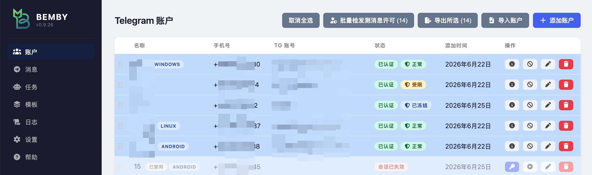
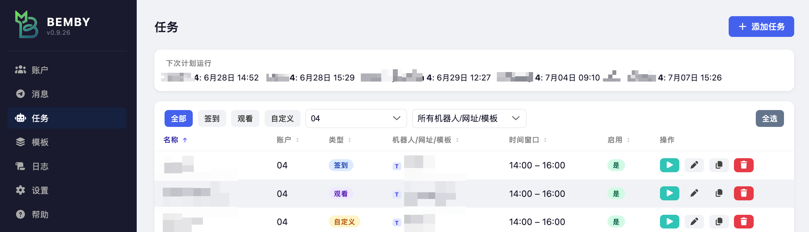
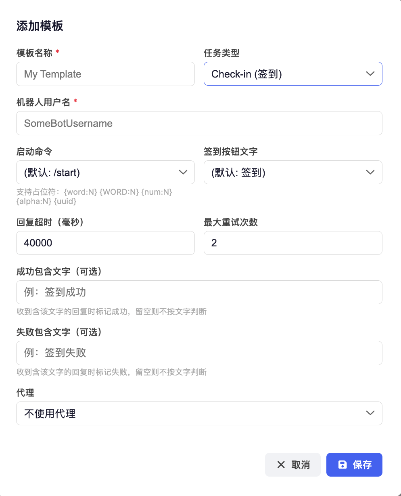
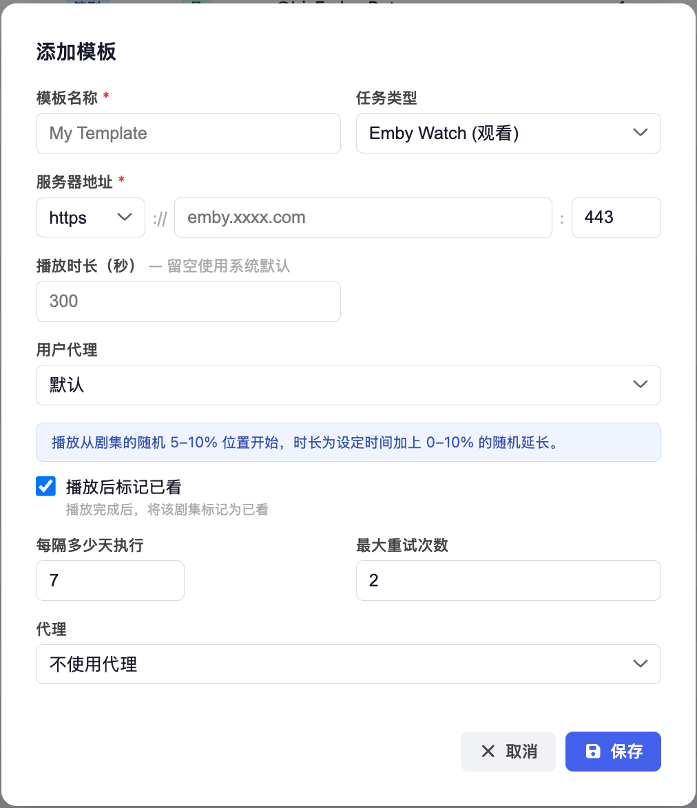
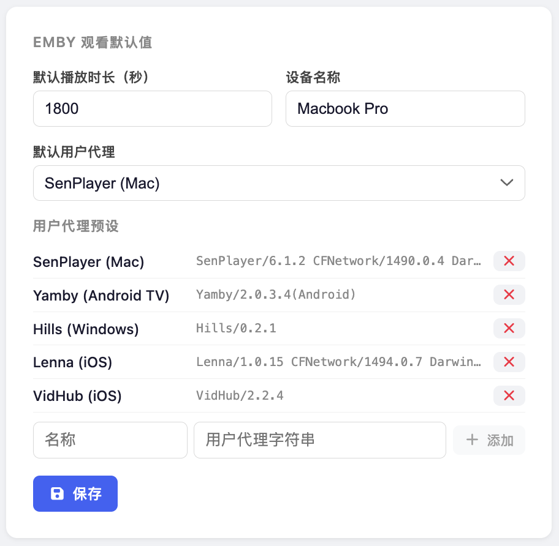

<p align="center">
  
</p>

# Bemby v0.9.27-patch-1

[English](#english) | **简体中文**

> 如果 Bemby 为你节省了时间，欢迎在 GitHub 上给它点个 Star，帮助更多人发现这个项目。

一款自托管的自动化工具，用于管理每日 Telegram 机器人签到和 Emby 视频观看会话。内置 Web 管理门户，支持多账号和多任务管理。

<table>
  <tr>
    <td align="center" colspan="3"><br/><sub>账户配置</sub></td>
  </tr>
  <tr>
    <td align="center" colspan="3"><br/><sub>任务配置</sub></td>
  </tr>
  <tr>
    <td align="center"><br/><sub>丰富内容日志</sub></td>
    <td align="center"><br/><sub>AI 调试</sub></td>
    <td align="center"><br/><sub>AI 设置</sub></td>
  </tr>
  <tr>
    <td align="center"><br/><sub>添加签到模版</sub></td>
    <td align="center"><br/><sub>添加观看模版</sub></td>
    <td align="center"><br/><sub>观看 UA 配置</sub></td>
  </tr>
</table>


---

## 功能特性

- **多账号** — 管理多个 Telegram 账号，每个账号通过 MTProto 独立认证；支持拖拽排序；会话失效时自动标记并显示重新认证按钮；代理徽章直接显示在账号行；账号列表新增 TG 账号列，显示 Telegram 显示名称和用户名（存储于数据库，首次访问自动获取，可手动刷新）
- **内置 Telegram 消息客户端** — 直接在 Bemby 中与联系人、群组和频道聊天；支持表情回应、引用回复、内联图片查看、频道帖子评论线程、机器人命令自动补全，以及自动标记消息已读
- **三种任务类型**
  - **签到** — 在随机的每日时间向 Telegram 机器人发送可配置命令并点击回复按钮
  - **Emby 观看** — 在 Emby 服务器上模拟播放会话，从随机进度位置开始，定期上报播放进度，结束后可标记为已看；User Agent 可从内置预设（SenPlayer、Yamby、Hills、Lenna、VidHub）中选择，也可在设置中自定义；可关联可选的 Telegram 账号用于发送通知
  - **自定义** — 通过可配置的多步骤流程操作任意 Telegram 机器人，每步可触发命令、等待消息、点击按钮（支持 `{aiBtn}` AI 自动识别）、输入验证码（`enter_captcha` 步骤：复用上一步按钮点击后机器人的回复图片，无需二次等待，自动识别后发送答案）；发送命令步骤支持 `{aiInput}` / `{aiInput:N}` 占位符，自动将上一条消息中的图片发给 AI 识别并将识别结果填入命令；每个动作（延时除外）可独立配置最大重试次数，失败时仅重试该动作而不中断整个任务链；整个任务链也支持独立的最大重试次数；等待回复步骤支持可选的成功/失败文字匹配，收到含指定文字的回复时自动标记成功或失败；输入验证码步骤若 AI 返回字符数与预期长度不符则视为失败并触发重试；任务失败时完整保存已执行步骤的详细日志，AI 调用的提示词与响应始终写入步骤日志（无需开启开发者模式）
- **命令模板** — 支持在启动命令中嵌入随机占位符（`{word:N}`、`{num:N}`、`{alpha:N}`、`{uuid}`）
- **AI 按钮识别** — 签到按钮文字设为 `{aiBtn}` 时，自动通过视觉大模型识别应点击的按钮（支持图片验证码类场景）；AI 返回结果与可用按钮不符时自动重试（最多不超过任务重试次数，硬性上限 5 次）；可在设置页面配置 API 地址、密钥和模型
- **调度器** — 在每个任务可配置的每日时间窗口内随机选取执行时间；失败时自动重试
- **实时日志** — 打开正在运行的任务日志时，详情面板实时刷新，每秒更新一次；任务完成后展示完整对话或播放摘要
- **详细日志** — 点击日志行可展开详情：签到任务显示仿 Telegram 气泡对话；Emby 观看任务显示播放摘要卡片（剧集信息、起止位置、已看标记）
- **TG 通知** — 可在设置中配置通知目标（用户名/t.me 链接）及触发时机（失败/成功），通过关联账号发送；未配置目标时默认发至"收藏夹"
- **停止运行中的任务** — 可在日志列表中随时中止正在执行的任务
- **复制任务** — 在任务列表中一键将现有任务复制为新任务
- **任务筛选** — 任务列表支持按账号、机器人/网址筛选
- **账号导出/导入** — 在设置页面将 Telegram 会话数据导出为 JSON 文件，可导入至另一 Bemby 实例，无需重新认证
- **开发者日志** — 在日志视图中开启"显示开发者日志"，可查看 AI 提示词及响应（含各次重试的回答）、各阶段耗时（连接、等待回复、按钮点击、按钮响应）、错误类型等调试信息；AI 步骤旁显示烧杯图标，点击可打开调试面板，支持实时修改提示词并重新调用 AI
- **登录验证码** — 管理员登录页面使用图形验证码
- **移动端友好** — 响应式布局，侧边栏折叠为汉堡菜单；表格自适应隐藏次要列；弹窗固定于顶部并使用动态视口高度避免被浏览器界面遮挡；任务列表的操作按钮在移动端合并为单一 ⋯ 按钮，点击后从屏幕底部弹出操作菜单
- **界面状态持久化** — 任务和日志页面的筛选条件、列排序方式在刷新后自动恢复；登录后自动跳回上次访问的页面
- **Web 管理门户** — Vue 3 单页应用，用于管理账号、任务、设置和查看日志
- **持久化存储** — SQLite 数据库，重启和容器升级后数据不丢失

---

## 环境要求

- Docker

---

## 快速开始

```bash
docker run -d \
  --name bemby \
  --restart unless-stopped \
  -p 3000:3000 \
  -v /docker/bemby-data:/app/data \
  -e ADMIN_USERNAME=admin \
  -e ADMIN_PASSWORD=changeme \
  -e JWT_SECRET=change-me-in-production \
  liveinaus/bemby:latest
```

默认值：端口 `3000`，数据库 `/app/data/bemby.db`，时区 UTC。如需指定时区，追加 `-e TZ=Asia/Shanghai`。

---


## 一键部署

不熟悉命令行或 Docker 的用户可通过以下云平台快速部署 Bemby，无需在本地安装任何工具。

> Bemby 使用 SQLite 存储数据。请确认所选平台支持**持久化存储卷**，否则服务重启后数据会丢失。

### Railway（推荐）

Railway 支持直接从 Docker Hub 镜像部署，无需 Fork 或连接 GitHub。新账户首月赠送 **$5 免费额度**，无需绑定信用卡，之后每月赠送1 美元。

[](https://railway.com/deploy/bemby?referralCode=o7RbM-&utm_medium=integration&utm_source=template&utm_campaign=generic)

点击按钮，按以下步骤完成配置：

1. 在部署页面填写以下环境变量：
   - `ADMIN_USERNAME` — 管理员用户名
   - `ADMIN_PASSWORD` — 管理员密码
   - `JWT_SECRET` — 随机长字符串，可用 `openssl rand -hex 32` 生成
   - `TZ` — 时区（可选，默认 `Asia/Shanghai`）
2. 点击 **Deploy** 等待部署完成
3. 部署完成后，点击服务进入 **Settings** 标签页，滚动至 **Networking → Public Networking**，点击 **Generate Domain** 获取访问地址（格式为 `*.up.railway.app`）

---

## 初次使用

### 1. 添加 Telegram 账号（签到任务需要）

1. 进入 **账号** 页面，点击 **添加账号**
2. 填写显示名称、手机号、API ID 和 API Hash
   - 从 [my.telegram.org/apps](https://my.telegram.org/apps) 获取 API ID/Hash
3. 点击 **请求验证码** — Telegram 将向该账号手机发送登录验证码
4. 点击 **验证** 并输入验证码（如已开启两步验证，还需输入密码）
5. 账号状态变为 **已认证**

### 2. 创建任务

进入 **任务** 页面，点击 **添加任务**，配置以下内容：

| 字段                    | 说明                                                              |
|-------------------------|-------------------------------------------------------------------|
| 任务名称                | 任务的显示名称                                                     |
| 任务类型                | `签到`、`Emby 观看` 或 `自定义`                                   |
| 账号                    | 已认证的 Telegram 账号（仅签到任务）                               |
| 机器人用户名            | Telegram 机器人 handle，可带或不带 `@`（仅签到任务）              |
| 启动命令                | 发送给机器人的命令，默认 `/start`；支持模板占位符（仅签到任务）   |
| 签到按钮文字            | 用于匹配内联键盘按钮的文字，默认 `签到`（仅签到任务）             |
| 服务器地址              | Emby 服务器地址，如 `https://emby.example.com:443`（仅 Emby 观看）；粘贴含协议和端口的完整 URL 时可自动解析 |
| Emby 用户名/密码        | Emby 账号凭证（仅 Emby 观看）                                     |
| 播放时长                | 模拟播放的秒数；实际时长在此基础上随机延长 0–10%（仅 Emby 观看）  |
| 播放后标记已看          | 播放结束后将该剧集/电影标记为已看（默认开启，仅 Emby 观看）       |
| 账号（可选）            | 关联的 Telegram 账号，用于发送成功/失败通知（仅 Emby 观看，可不填）|
| 时间窗口开始/结束        | 每日执行时间窗口，格式 HHMM，如 `1400`–`1600`                    |
| 最大重试次数            | 失败时的重试次数                                                   |

调度器每天在时间窗口内随机选取执行时间。若保存任务时当日窗口已过，则顺延至次日。

### 3. 系统设置

进入 **设置** 页面可配置：

- **默认时区** — 用于所有任务的调度时间窗口
- **默认最大重试次数**
- **每日只执行一次** — 测试时可关闭此选项，使任务当日可重复执行
- **Emby 观看默认值** — 播放时长、设备名称和默认 User Agent；**User Agent 预设** — 内置 SenPlayer、Yamby、Hills、Lenna、VidHub 五个预设，可在设置中增删自定义预设
- **AI 按钮识别** — 配置用于 `{aiBtn}` 功能的 AI 服务商；全新安装时默认预置 OpenRouter（`https://openrouter.ai/api/v1`）及 `nvidia/nemotron-nano-12b-v2-vl:free` 模型，在设置页面添加 API 密钥即可启用；兼容所有 OpenAI 兼容接口，可添加任意服务商
- **TG 通知** — 配置接收通知的 Telegram 目标（支持用户名、@用户名或 t.me 链接）及触发时机（失败/成功）；未配置目标时发至"收藏夹"
- **TG 应用客户端** — 自定义 Telegram 会话的设备信息；可设为固定默认或从所有预设中随机选取
- **管理员凭证** — 修改管理员用户名或密码

---

## 本地开发

**所需工具：** Node.js 20+、Git

```bash
git clone https://github.com/liveinaus/Bemby.git
cd Bemby
./dev.sh
```

首次运行时，`dev.sh` 会将 `env.example` 复制为 `backend/.env`，并在占位符值未修改时发出警告。

| 服务     | 默认地址                      |
|----------|-------------------------------|
| 前端     | http://localhost:5173         |
| 后端     | http://localhost:3000         |

使用 `backend/.env` 中配置的账号登录（默认 `admin` / `changeme`）。

---

## 项目结构

```
bemby/
├── backend/
│   └── src/
│       ├── server.ts          -- Express 入口
│       ├── scheduler.ts       -- 基于 setTimeout 的任务调度器
│       ├── db/
│       │   └── database.ts    -- SQLite 初始化和迁移
│       ├── jobs/
│       │   ├── runner.ts      -- 任务分发与重试
│       │   ├── checkin.ts     -- Telegram MTProto 签到逻辑
│       │   ├── embywatch.ts   -- Emby 播放模拟
│       │   └── notify.ts      -- TG 自身通知工具
│       ├── routes/
│       │   ├── auth.ts        -- 登录、JWT、凭证管理、验证码
│       │   ├── accounts.ts    -- Telegram 账号 CRUD 及认证流程
│       │   ├── jobs.ts        -- 任务 CRUD 及手动触发
│       │   ├── logs.ts        -- 任务执行日志查询
│       │   ├── settings.ts    -- 系统设置键值存储
│       │   └── status.ts      -- 调度器下次执行状态
│       └── types.ts
├── frontend/
│   └── src/
│       ├── views/
│       │   ├── AccountsView.vue
│       │   ├── JobsView.vue
│       │   ├── LogsView.vue
│       │   ├── SettingsView.vue
│       │   └── HelpView.vue
│       ├── api/client.ts      -- Axios API 客户端及类型
│       └── router/index.ts
├── docker-compose.yml
├── Dockerfile
├── dev.sh                     -- 本地开发启动脚本（后端 + 前端）
└── env.example
```

---

## 调度器工作原理

1. 启动时（以及任务创建/更新/删除后），`refreshScheduler()` 重新运行
2. 对每个已启用的任务调用 `pickNextRun()`：
   - 当前时间在窗口**之前** → 在今日完整窗口内随机安排
   - 当前时间在窗口**之内** → 在今日剩余窗口时间内随机安排
   - 窗口已**过去**（或任务今日已执行且开启了"每日只执行一次"）→ 安排在明日窗口内执行
3. `setTimeout` 在指定时间触发并执行任务
4. 执行完成（无论成功或失败）后立即为次日重新调度
5. 后台每 5 分钟轮询一次，补偿停机期间遗漏的任务

---

## Emby 观看详情

Emby 观看任务以真实 Emby 用户身份认证，模拟选定客户端（默认为 macOS SenPlayer 6.1.2）的播放会话：

- 从媒体库中随机选取一部电影或剧集
- 播放起始位置随机选取剧集总时长的 5–10% 处
- 上报播放开始（`POST /Sessions/Playing`）
- 每 30 秒发送进度更新（`POST /Sessions/Playing/Progress`）
- 实际播放时长为设定时长加上随机 0–10% 的延长
- 在计算后的结束位置上报会话结束（`POST /Sessions/Playing/Stopped`）
- 若启用"播放后标记已看"，调用 `POST /Users/{id}/PlayedItems/{itemId}` 将该内容标记为已看

Emby 服务器将该会话识别为与所选 User Agent 预设对应的客户端（默认为 **Mac / SenPlayer**）。

---

## TODO

- [ ] 过 CF 签到 — 支持带 Cloudflare 防护的机器人签到
- [ ] 自动抢注 — 自动完成新账号注册流程
- [ ] 自动答题 — 自动识别并回答机器人问题

---

## 贡献

欢迎贡献代码。开始之前：

1. Fork 仓库并创建功能分支
2. 修改代码 — 遵循现有代码风格（TypeScript strict、Vue 3 Composition API）
3. 使用 `./dev.sh` 在本地测试
4. 提交 Pull Request，清晰描述修改内容和原因

请保持 Pull Request 聚焦。欢迎提交 Bug 修复、稳定性改进、新任务类型和界面优化。如果计划进行较大改动，请先提 Issue 讨论方案。

---

## 免责声明

Bemby 仅供个人自动化和学习目的使用。请负责任地使用，并遵守所交互平台（Telegram、Emby 等）的服务条款。

对于因使用本软件而导致的账号封禁、数据丢失、服务中断或任何其他后果，作者不承担任何责任。使用风险由您自行承担。

---

## 许可证

版权所有 (c) 2024 Bemby contributors

特此免费授予任何人获取本软件副本并使用、复制、修改、分发的权利，须遵守以下条件：

- **署名** — 任何分发的副本或衍生作品，无论是否修改，必须清晰注明原始来源（提供本仓库链接即可）。
- 以上版权声明和本许可声明须包含在软件的所有副本或主要部分中。

本软件按"原样"提供，不附带任何形式的保证。在任何情况下，作者均不对因使用本软件而产生的任何索赔、损害或其他责任负责。

---

<a name="english"></a>

<p align="center">
  
</p>

## English

[简体中文](#bemby-v0926) | **English**

> If Bemby saves you time, please consider giving it a star on GitHub. It helps others find the project and keeps development going.

A self-hosted automation tool for managing daily Telegram bot check-ins (签到) and Emby video-watch sessions. Includes a web admin portal for managing multiple accounts and jobs.

<table>
  <tr>
    <td align="center" colspan="3"><br/><sub>Account configuration</sub></td>
  </tr>
  <tr>
    <td align="center" colspan="3"><br/><sub>Job configuration</sub></td>
  </tr>
  <tr>
    <td align="center"><br/><sub>Rich content logs</sub></td>
    <td align="center"><br/><sub>AI debug console</sub></td>
    <td align="center"><br/><sub>AI provider settings</sub></td>
  </tr>
  <tr>
    <td align="center"><br/><sub>Add check-in template</sub></td>
    <td align="center"><br/><sub>Add Emby Watch template</sub></td>
    <td align="center"><br/><sub>Emby Watch UA settings</sub></td>
  </tr>
</table>

---

### Features

- **Multi-account** — manage multiple Telegram accounts, each independently authenticated via MTProto; drag-and-drop reordering; automatic session-expiry detection with re-auth prompt; proxy badge shown inline on each account row; a TG Name column shows each account's Telegram display name and username (stored in the database, auto-fetched on first visit, refreshable on demand)
- **Built-in Telegram Messenger** — chat with contacts, groups, and channels directly from Bemby; supports emoji reactions, quoted replies, inline photo viewing, channel post comment threads, bot command autocomplete, and automatic read-marking
- **Three job types**
  - **Check-in (签到)** — sends a configurable command to a Telegram bot and clicks the reply button on a randomised daily schedule
  - **Emby Watch** — simulates a playback session on an Emby server, starting from a random position, reporting progress at regular intervals, and optionally marking the item as watched; User Agent is selectable from built-in presets (SenPlayer, Yamby, Hills, Lenna, VidHub) or custom values managed in Settings; supports an optional linked Telegram account for notifications
  - **Custom** — configurable multi-step flows that interact with any Telegram bot: send commands, wait for replies, click buttons (with `{aiBtn}` AI selection), or run an **Enter Captcha** step that reuses the bot's reply from the preceding button click without waiting again, automatically recognises the image, and sends the answer; the `{aiInput}` / `{aiInput:N}` placeholder in a send-command step feeds the previous message's image to AI and substitutes the result into the command; each action (except delay) has its own max retry count — only that action is retried on failure, not the whole chain; the whole action chain also has its own max retry count independent of the global job retry; wait-for-reply supports optional success/fail text matching to classify replies automatically; enter-captcha validates the AI response length against the configured count and retries on mismatch; AI prompt and response are always visible per step in logs without needing developer logs enabled
- **Command templates** — embed random placeholders in the start command (`{word:N}`, `{num:N}`, `{alpha:N}`, `{uuid}`)
- **AI button detection** — set the check-in button to `{aiBtn}` and a vision model automatically identifies which button to click, including image-based CAPTCHA-style challenges; when the AI response does not match an available button it retries automatically (up to the job's max retries, hard-capped at 5); a fresh install pre-configures OpenRouter (`https://openrouter.ai/api/v1`) with the `nvidia/nemotron-nano-12b-v2-vl:free` model — just add your API key in Settings to activate it
- **Scheduler** — picks a random time within a configurable daily window per job; handles retry on failure
- **Live log streaming** — opening a running job's log shows real-time updates as each step completes, refreshing every second
- **Rich log detail** — click any log row to expand: check-in jobs show a Telegram-style chat view; Emby Watch jobs show a playback summary card with episode info and position data
- **TG notifications** — configure a notification target and trigger events (failed / success) in Settings; the linked account sends to the configured target, falling back to Saved Messages if none is set
- **Stop running jobs** — cancel an in-progress job directly from the log list
- **Duplicate job** — copy any existing job into a new job with one click from the job list
- **Job filters** — filter the jobs list by account or by bot / URL
- **Account export/import** — export Telegram session data from Settings as a JSON file and import it into another Bemby instance without re-authenticating
- **Developer logs** — enable "Show developer logs" in the log view to see timing breakdowns (connect, reply latency, button click, button response), AI prompt and response (including responses from each retry attempt), error type, and per-step metadata; a flask icon on any AI step opens a debug panel where you can edit the prompt and re-run the AI call live
- **Login CAPTCHA** — SVG CAPTCHA on the admin login page
- **Mobile-friendly** — responsive layout, sidebar collapses to a hamburger menu; tables hide secondary columns on narrow screens; modals pin to the top and use dynamic viewport height to stay clear of browser chrome; job action buttons merge into a single ⋯ button on mobile, opening a bottom action sheet
- **UI state persistence** — filter selections and column sort order are restored automatically on refresh; login redirects back to the last visited page
- **Web admin portal** — Vue 3 SPA for managing accounts, jobs, settings, and viewing logs
- **Persistent storage** — SQLite database, survives restarts and container upgrades

---

### Requirements

- Docker

---

### Quick Start

```bash
docker run -d \
  --name bemby \
  --restart unless-stopped \
  -p 3000:3000 \
  -v /docker/bemby-data:/app/data \
  -e ADMIN_USERNAME=admin \
  -e ADMIN_PASSWORD=changeme \
  -e JWT_SECRET=change-me-in-production \
  liveinaus/bemby:latest
```

Defaults: port `3000`, database at `/app/data/bemby.db`, timezone UTC. To set a timezone add `-e TZ=Australia/Sydney`.

---


### One-click Deploy

Not comfortable with the command line or Docker? Deploy Bemby to a cloud platform in a few clicks — no local tooling required.

> Bemby uses SQLite for storage. Make sure your chosen platform supports a **persistent volume**, otherwise data is lost on every restart.

#### Railway *(recommended)*

Railway can deploy directly from the Docker Hub image — no GitHub fork or account connection needed. New accounts get **$5 free credit 1st month** with no credit card required, then you get $1 per month after.

[](https://railway.com/deploy/bemby?referralCode=o7RbM-&utm_medium=integration&utm_source=template&utm_campaign=generic)

Click the button and follow these steps:

1. Fill in the environment variables when prompted:
   - `ADMIN_USERNAME` — your admin username
   - `ADMIN_PASSWORD` — your admin password
   - `JWT_SECRET` — any long random string (e.g. `openssl rand -hex 32`)
   - `TZ` — your timezone (optional, defaults to `Asia/Shanghai`)
2. Click **Deploy** and wait for the deployment to complete
3. Once deployed, open the service → **Settings** tab → scroll to **Networking → Public Networking** → click **Generate Domain** to get your public URL (e.g. `your-app.up.railway.app`)

---

### First-time setup

#### 1. Add a Telegram account (for check-in jobs)

1. Go to **Accounts** and click **Add Account**
2. Enter a display name, phone number, API ID, and API Hash
   - Get API ID/Hash from [my.telegram.org/apps](https://my.telegram.org/apps)
3. Click **Request Code** — Telegram sends a login code to the account's phone
4. Click **Verify** and enter the code (and 2FA password if enabled)
5. Status changes to **Authenticated**

#### 2. Create a job

Go to **Jobs** and click **Add Job**. Configure:

| Field                   | Description                                                                          |
|-------------------------|--------------------------------------------------------------------------------------|
| Job Name                | Display name for the job                                                             |
| Job Type                | `Check-in`, `Emby Watch`, or `Custom`                                                |
| Account                 | Authenticated Telegram account (check-in only)                                       |
| Bot Username            | Telegram bot handle, with or without `@` (check-in only)                             |
| Start Command           | Command sent to the bot, default `/start`; supports template placeholders (check-in only) |
| Check-in Button         | Text to match against the inline keyboard button, default `签到` (check-in only)     |
| Server URL              | Emby server address, e.g. `https://emby.example.com:443` (Emby Watch only); paste a full URL with protocol and port to auto-fill the fields |
| Emby Username/Password  | Emby account credentials (Emby Watch only)                                           |
| Play Duration           | Seconds to simulate playback; actual duration is this value plus 0–10% random extra (Emby Watch only) |
| Mark as watched         | Mark the episode/movie as watched in Emby after playback ends (default on, Emby Watch only) |
| Account (optional)      | Telegram account to send success/failure notifications via (Emby Watch only; leave blank to disable notifications) |
| Window Start/End        | Daily schedule window in HHMM format, e.g. `1400`–`1600`                            |
| Max Retries             | Number of retry attempts on failure                                                  |

The scheduler picks a random time within the window each day. If the window has already passed when the job is saved, it schedules for the following day.

#### 3. System settings

Go to **Settings** to configure:

- **Default timezone** — used for all job schedule windows
- **Default max retries**
- **Enforce one run per day** — disable this when testing so jobs can re-run even if they already ran today
- **Emby Watch defaults** — play duration, device name, and default User Agent; **UA presets** — five built-in presets (SenPlayer, Yamby, Hills, Lenna, VidHub) with the ability to add and remove custom presets in Settings
- **AI Providers** — manage AI suppliers and models; a fresh install pre-configures OpenRouter with the `nvidia/nemotron-nano-12b-v2-vl:free` model — add your API key in Settings to activate; supports any OpenAI-compatible provider; a warning banner appears on any provider with no API key configured
- **TG Notifications** -- configure a notification target (username, @username, or t.me link) and which events trigger a notification (failed / success); falls back to Saved Messages if no target is set
- **TG App Clients** — customise the device fingerprint Telegram sees per account; set one as default or enable random selection to rotate across all configured presets
- **Admin credentials** — change the admin username or password

---

### Local development

**Requirements:** Node.js 20+, Git

```bash
git clone https://github.com/liveinaus/Bemby.git
cd Bemby
./dev.sh
```

On first run `dev.sh` copies `env.example` to `backend/.env` and warns if placeholder values are still set.

| Service  | Default URL                  |
|----------|------------------------------|
| Frontend | http://localhost:5173        |
| Backend  | http://localhost:3000        |

Log in with the credentials configured in `backend/.env` (default `admin` / `changeme`).

---

### Project structure

```
bemby/
├── backend/
│   └── src/
│       ├── server.ts          -- Express entry point
│       ├── scheduler.ts       -- Per-job setTimeout scheduler
│       ├── db/
│       │   └── database.ts    -- SQLite setup and migrations
│       ├── jobs/
│       │   ├── runner.ts      -- Job dispatcher with retry
│       │   ├── checkin.ts     -- Telegram MTProto check-in logic
│       │   ├── embywatch.ts   -- Emby playback simulation
│       │   └── notify.ts      -- TG self-notification utility
│       ├── routes/
│       │   ├── auth.ts        -- Login, JWT, credential management, CAPTCHA
│       │   ├── accounts.ts    -- Telegram account CRUD and auth flow
│       │   ├── jobs.ts        -- Job CRUD and manual trigger
│       │   ├── logs.ts        -- Job execution log queries
│       │   ├── settings.ts    -- System settings key/value store
│       │   └── status.ts      -- Scheduler next-run status
│       └── types.ts
├── frontend/
│   └── src/
│       ├── views/
│       │   ├── AccountsView.vue
│       │   ├── JobsView.vue
│       │   ├── LogsView.vue
│       │   ├── SettingsView.vue
│       │   └── HelpView.vue
│       ├── api/client.ts      -- Axios API client and types
│       └── router/index.ts
├── docker-compose.yml
├── Dockerfile
├── dev.sh                     -- Local dev launcher (backend + frontend)
└── env.example
```

---

### How the scheduler works

1. On startup (and after any job create/update/delete), `refreshScheduler()` runs
2. For each enabled job it calls `pickNextRun()`:
   - If the current time is **before** the window -> schedules randomly within the full window today
   - If the current time is **inside** the window -> schedules randomly within the remaining window time today
   - If the window has **passed** (or the job already ran today and *Enforce one run per day* is on) -> schedules within the window tomorrow
3. A `setTimeout` fires at the chosen time and executes the job
4. On completion (success or failure) the job is immediately rescheduled for the next day
5. A background poll runs every 5 minutes to catch any jobs missed during downtime

---

### Emby Watch details

The Emby Watch job authenticates as a real Emby user and simulates the selected client's playback session (defaulting to SenPlayer 6.1.2 on macOS):

- Picks a random movie or episode from the library
- Starts playback at a random position between 5–10% into the episode
- Reports playback started (`POST /Sessions/Playing`)
- Sends progress updates every 30 seconds (`POST /Sessions/Playing/Progress`)
- Actual duration is the configured play time plus a random 0–10% extra
- Reports the session as stopped at the calculated end position (`POST /Sessions/Playing/Stopped`)
- If "Mark as watched" is enabled, calls `POST /Users/{id}/PlayedItems/{itemId}` to mark the item as watched

The Emby server sees the session as the client matching the selected User Agent preset (default: **Mac / SenPlayer**).

---

### TODO

- [ ] Pass CF for check-in — support bots protected by Cloudflare
- [ ] Auto registration — automatically complete new account sign-up flows
- [ ] Auto quiz — automatically identify and answer bot quiz questions

---

### Contributing

Contributions are welcome. To get started:

1. Fork the repository and create a feature branch
2. Make your changes — follow the existing code style (TypeScript strict, Vue 3 Composition API)
3. Test locally with `./dev.sh`
4. Open a pull request with a clear description of what changed and why

Please keep pull requests focused. Bug fixes, reliability improvements, new job types, and UI polish are all appreciated. If you are planning a larger change, open an issue first to discuss the approach.

---

### Disclaimer

Bemby is provided for personal automation and educational purposes only. Use it responsibly and in accordance with the terms of service of any platform you interact with (Telegram, Emby, etc.).

The authors accept no liability for account suspension, data loss, service disruption, or any other consequence arising from the use of this software. You run it at your own risk.

---

### Licence

Copyright (c) 2024 Bemby contributors

Permission is hereby granted, free of charge, to any person obtaining a copy of this software to use, copy, modify, and distribute it, subject to the following conditions:

- **Attribution** — any distributed copy or derivative work, whether modified or unmodified, must clearly state the original source (a link to this repository is sufficient).
- The above copyright notice and this permission notice must be included in all copies or substantial portions of the software.

THE SOFTWARE IS PROVIDED "AS IS", WITHOUT WARRANTY OF ANY KIND. IN NO EVENT SHALL THE AUTHORS BE LIABLE FOR ANY CLAIM, DAMAGES, OR OTHER LIABILITY ARISING FROM THE USE OF THE SOFTWARE.
